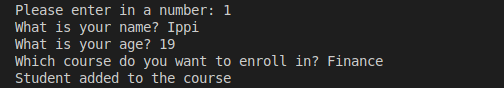
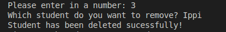
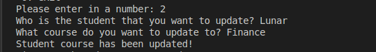
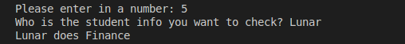

# Student Management System

## Table of Contents

- [Student Management System](#student-management-system)
  - [Table of Contents](#table-of-contents)
  - [Getting Started](#getting-started)
    - [Cloning repo](#cloning-repo)
  - [Introduction](#introduction)
  - [Add](#add)
  - [Remove](#remove)
  - [Update](#update)
  - [Check](#check)

## Getting Started

### Cloning repo
    git clone https://github.com/RanulJaya/StudentManagmentSystemCLI.git

## Introduction

This is a Student Management System for users to add, remove, update

## Add

This will ask the user to enter in the name, age and course for the new student to be added in:

## Remove

Option allows user to remove students from the list:

## Update

This allows user to update the students from the current course to a new course:

## Check

This option allows the user to check what course the student is currently doing:

